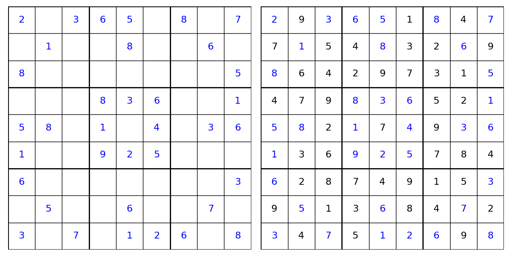

# Sudoku Solver

## Overview

This project implements a Sudoku solver by framing Sudoku as an [exact cover problem](https://en.wikipedia.org/wiki/Exact_cover), which is then solved using **Algorithm DLX**. This implementation utilizes the **Dancing Links** technique to quickly select permutations of rows as possible solutions and to efficiently backtrack mistaken guesses. The algorithms are implemented as detailed in [Dancing Links, Donald E. Knuth, arXiv:cs/0011047v1 [cs.DS] 15 Nov 2000](https://arxiv.org/abs/cs/0011047).

The python implementation can be found in ```utils/algorithmx.py```.

## Examples

Examples of solving Sudoku puzzles can be found in the notebook ```sudoku_solver.ipynb```.

Below is a sample solution:
